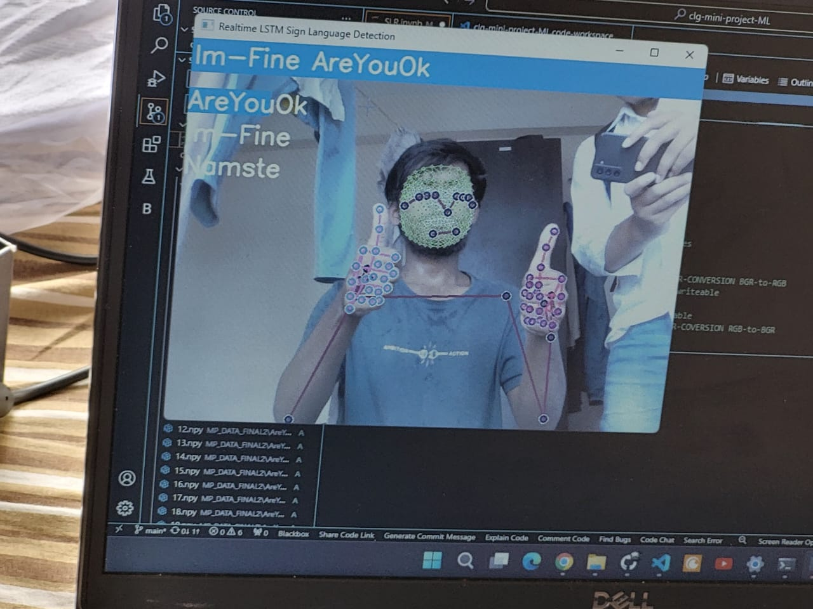
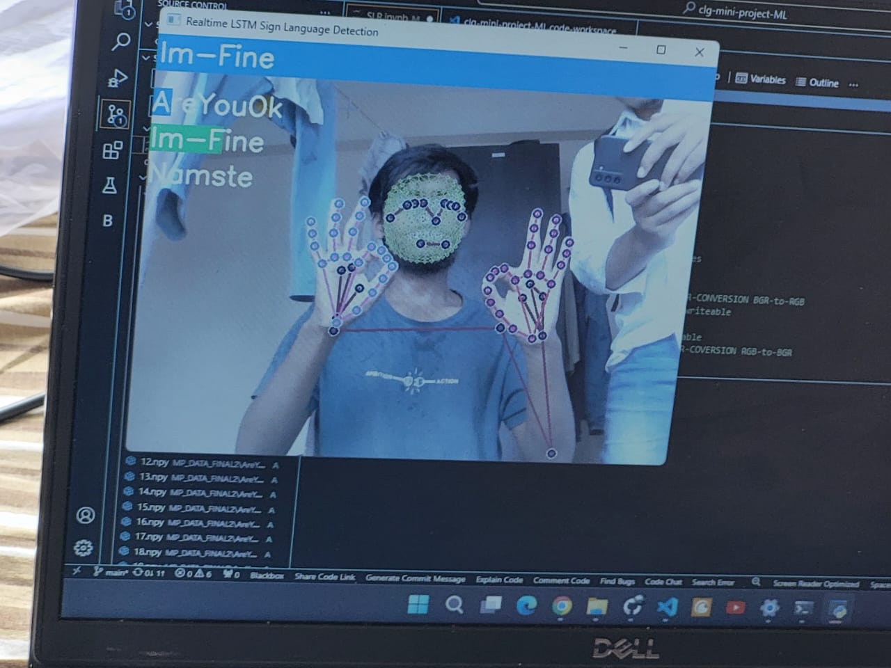
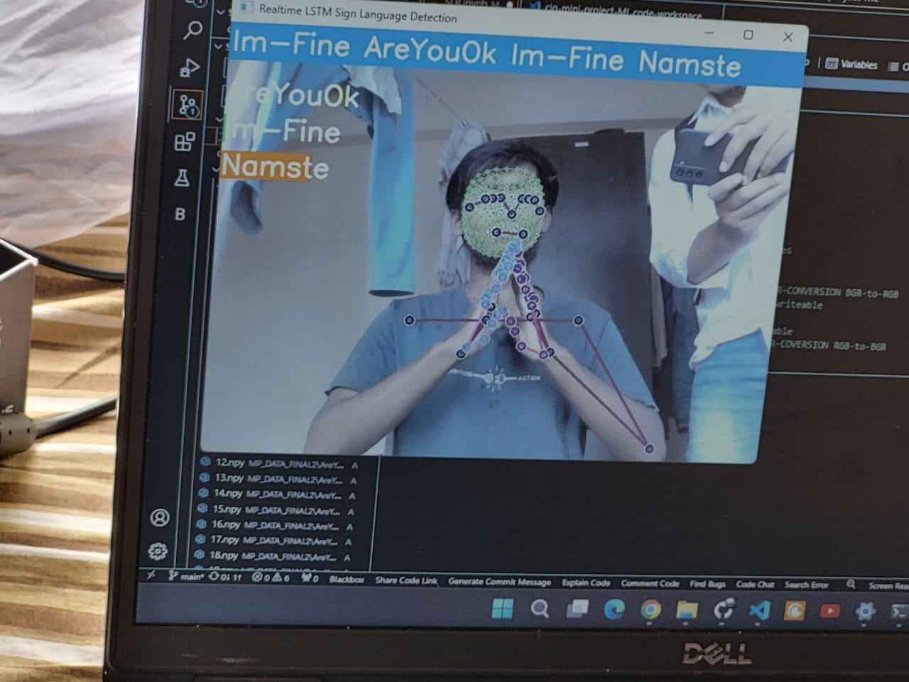
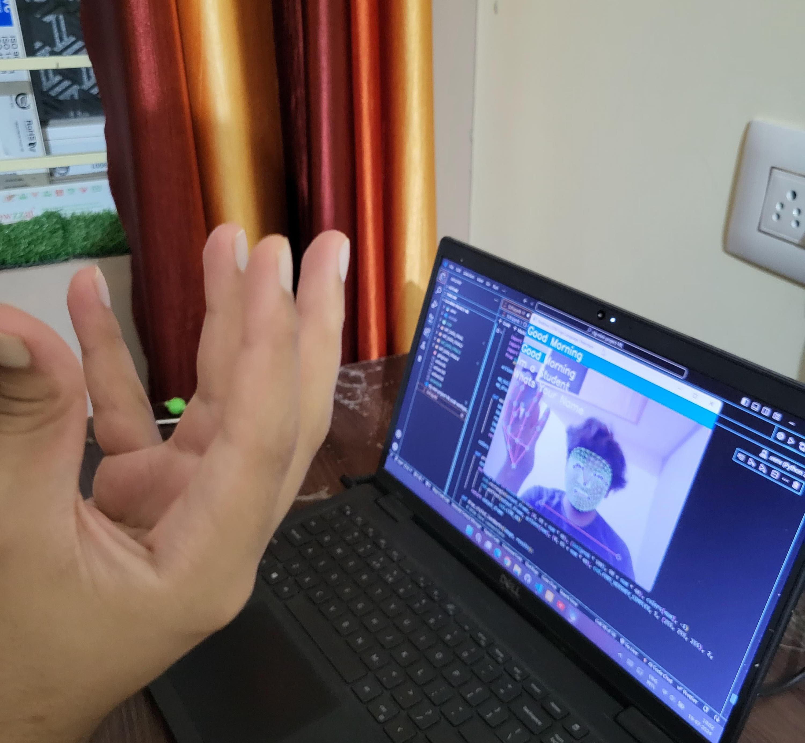

# Sign Language Recognition using Deep Learning and LSTM

This project implements a sign language recognition system using deep learning, specifically Long Short-Term Memory (LSTM) networks, combined with MediaPipe's Holistic detection to track and recognize hand gestures.

## Table of Contents
- [Introduction](#introduction)
- [DEMO](#DEMO)
- [Features](#features)
- [Project Structure](#project-structure)
- [Installation](#installation)
- [Model Training](#model-training)
- [Results](#results)
- [Contributing](#contributing)

## Introduction

This project aims to recognize sign language gestures using deep learning techniques. The system is built with TensorFlow and Keras for the deep learning model, and MediaPipe Holistic for detecting and tracking hand and body movements.

## DEMO
```
If video not available click view raw !
```

[Watch the Video](SLR-reults/vedio/SLR_res.mp4)


## Features

- Real-time sign language recognition
- Utilizes LSTM networks for sequence prediction
- Uses MediaPipe Holistic for accurate hand, face, and pose tracking

## Project Structure

```plaintext
Your Folder
  |__SLR.pynb
  |__action.h5
  |__MP_DATA
    |__actionSequence1
      |__1_to_30 folders
    |__actionSequence2
      |__1_to_30 folders
    |__actionSequence3
      |__1_to_30 folders
  |__Logs
      |__train
      |__validation
  └── README.md

//Here Use many MP_DATA folders for more actions , and also make more action.h5 folders for more models so in total we get more hand geustures
```
## Installation

### Prerequisites

- Python 3.8 or higher
- Git

### Clone the Repository

```bash
git clone https://github.com/yourusername/sign-language-recognition.git
cd sign-language-recognition
```

## Install Dependencies
It is recommended to use a virtual environment to manage dependencies:

```
python -m venv venv
source venv/bin/activate  # On Windows use `venv\Scripts\activate`
```
## Install the required packages:
```
pip install -r requirements.txt

```
## Model-training
```
model.fit()
```
use this command to train the model from tensor-flow 

## Results 

<p align="center">
  
   
   
   
</p>

```
The trained models are action.h5 files. The results of the training, including loss and accuracy plots, can be visualized using the Matplotlib library.
```

## Contributing

If you'd like to contribute to this project, please fork the repository and submit a pull request. We welcome any improvements or suggestions.


