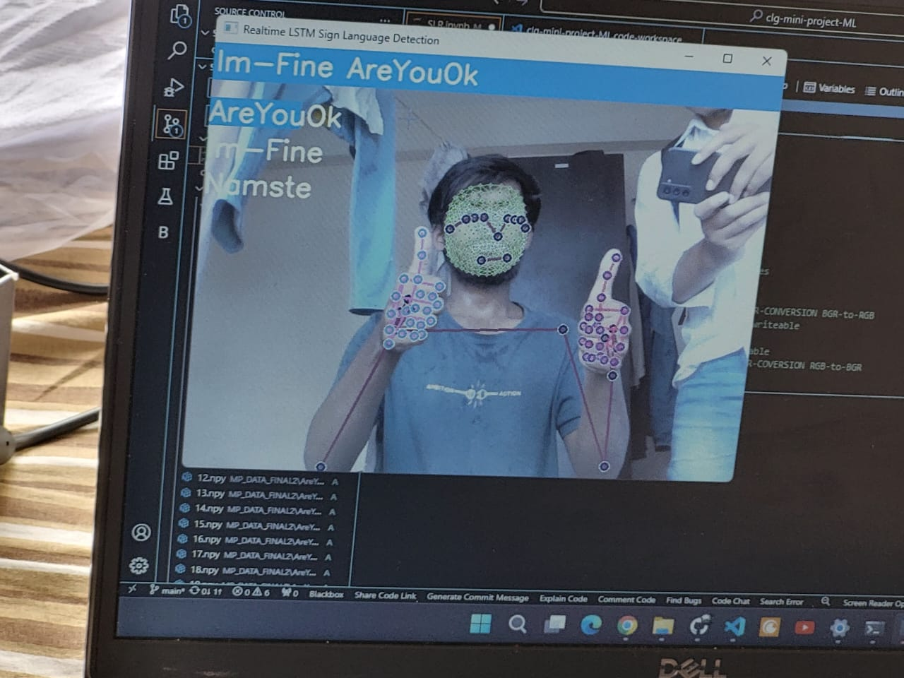
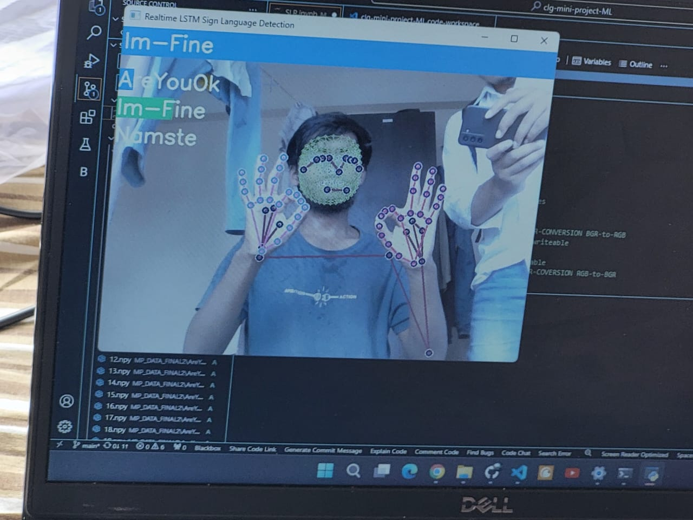
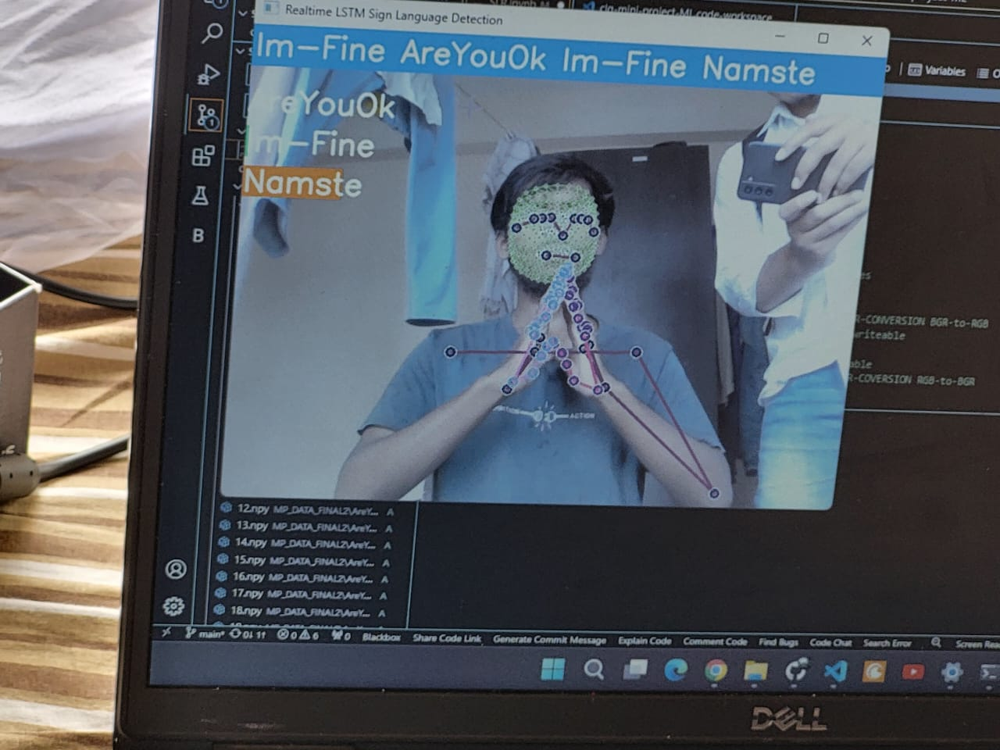
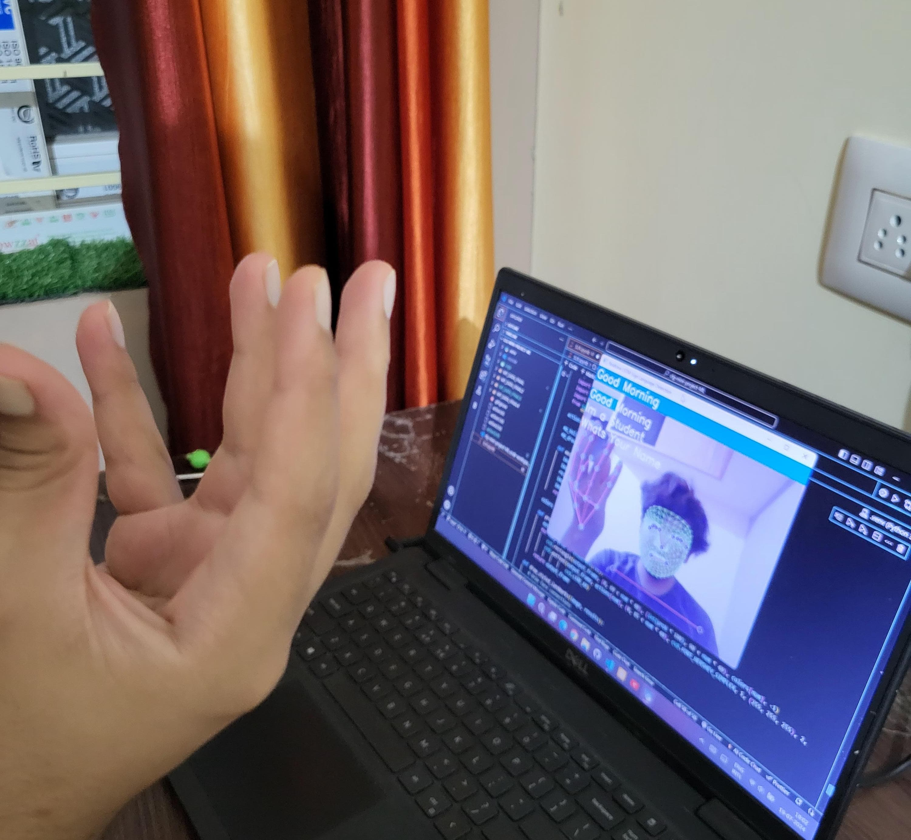

# Sign Language Recognition using Deep Learning and LSTM

This project implements a sign language recognition system using deep learning, specifically Long Short-Term Memory (LSTM) networks, combined with MediaPipe's Holistic detection to track and recognize hand gestures.

## Table of Contents
- [Introduction](#introduction)
- [DEMO](#DEMO)
- [Features](#features)
- [Project Structure](#project-structure)
- [Installation](#installation)
- [Model Training](#model-training)
- [Results](#results)
- [Contributing](#contributing)

## Introduction

This project aims to recognize sign language gestures using deep learning techniques. The system is built with TensorFlow and Keras for the deep learning model, and MediaPipe Holistic for detecting and tracking hand and body movements.

## DEMO

If video not available click view raw !


[Watch the Video](SLR-reults/vedio/SLR_res.mp4)


## Features

- Real-time sign language recognition
- Utilizes LSTM networks for sequence prediction
- Uses MediaPipe Holistic for accurate hand, face, and pose tracking

## Project Structure

```
Your Folder
  |__SLR.pynb
  |__action.h5
  |__MP_DATA
    |__actionSequence1
      |__1_to_30 folders
    |__actionSequence2
      |__1_to_30 folders
    |__actionSequence3
      |__1_to_30 folders
  |__Logs
      |__train
      |__validation
  └── README.md
```

//Here Use many MP_DATA folders for more actions , and also make more action.h5 folders for more models so in total we get more hand geustures

## Installation

### Prerequisites

- Python 3.8 or higher
- Git

### Clone the Repository

```bash
git clone https://github.com/yourusername/sign-language-recognition.git
cd sign-language-recognition
```

## Install Dependencies
It is recommended to use a virtual environment to manage dependencies:

```
python -m venv venv
source venv/bin/activate  # On Windows use `venv\Scripts\activate`
```
## Install the required packages:
```
pip install -r requirements.txt

```
## Model-training
```
model.fit()
```
use this command to train the model from tensor-flow 

## outcomes 

<p align="center">
  
   
   
   
</p>


The trained models are action.h5 files. The results of the training, including loss and accuracy plots, can be visualized using the Matplotlib library.


## Details about the project

This project aims to recognize sign language gestures using deep learning techniques. The system is built with TensorFlow and Keras for the deep learning model, and MediaPipe Holistic for detecting and tracking hand movements.
Tech Stack used : Python , TensorFlow , OpenCV, MediaPipe 
Implementations : LSTM , Custom Dataset
OS used : Ubuntu  
Working : 
1. Have used MediaPipe to get the landmarks of face , and hand with the help of OpenCv to capture face and hand postures and store as keypoints 
2. After which we extract the keypoints we convert it numpy array format for feature engineering 
3.Create respective signs folder and store the data (custom dataset) and split them to train , test and validation sets  
4.Then we train the sequential model using LSTM (its like a classification model) based on the test results tells weather the current sign shown via CV2 capture is the respected sign 

Our project had a accuracy over 93% and Further enhancement can be made by implementing a client-server model and making the model act as a backend .

## Contributing

If you'd like to contribute to this project, please fork the repository and submit a pull request. We welcome any improvements or suggestions.


# Integration of HARDWARE 

## requirements 
Raspberry Pi 4 (4GB/8GB) or Raspberry Pi 5. Use a 64-bit Raspberry Pi OS (Bookworm/64-bit) or Ubuntu arm64 for best binary compatibility.
Camera: Raspberry Pi Camera (CSI v2/v3) for best fps (use Picamera2), or a decent USB webcam (works with cv2.VideoCapture).

## To Do
current model input size (~1662 features × 30 frames) is heavy (face landmarks are the big offender). On a Pi you’ll get far better results if you reduce input dimensionality:
 Use both hands + pose only (no face). That reduces vector size drastically and retains gesture info.
hands: 2 × 21 points × 3 = 126 values
pose: 33 points × 4 = 132 values
per-frame input ≈ 258 instead of 1662 → model much lighter.

```
def extract_keypoints_light(results):
    pose = np.array([[res.x, res.y, res.z, res.visibility] 
                     for res in results.pose_landmarks.landmark]).flatten() \
           if results.pose_landmarks else np.zeros(33*4)
    lh = np.array([[res.x, res.y, res.z] 
                   for res in results.left_hand_landmarks.landmark]).flatten() \
         if results.left_hand_landmarks else np.zeros(21*3)
    rh = np.array([[res.x, res.y, res.z] 
                   for res in results.right_hand_landmarks.landmark]).flatten() \
         if results.right_hand_landmarks else np.zeros(21*3)
    return np.concatenate([pose, lh, rh])
```

## Convert your Keras .h5 to TensorFlow Lite

Converting to .tflite reduces memory and lets you use tflite-runtime (faster and lighter on Pi). Try to quantize (float16 or full int8 if you have calibration data) to speed up and shrink the model.

Conversion script:

```
import tensorflow as tf

model = tf.keras.models.load_model('sign_model.h5')

converter = tf.lite.TFLiteConverter.from_keras_model(model)
converter.optimizations = [tf.lite.Optimize.DEFAULT]
# float16 quantization (good balance)
converter.target_spec.supported_types = [tf.float16]
tflite_model = converter.convert()

with open('sign_model_float16.tflite', 'wb') as f:
    f.write(tflite_model)
```

If you want full int8, you'll need a representative dataset for calibration. (Docs: TensorFlow Lite conversion). 

## Pi environment — packages to install

On the Pi (assume Debian-based Raspberry Pi OS):

```
sudo apt update && sudo apt upgrade -y
sudo apt install -y python3-pip python3-venv python3-opencv ffmpeg libatlas-base-dev
# create venv
python3 -m venv ~/venv_slr
source ~/venv_slr/bin/activate
pip install --upgrade pip
# lightweight TF runtime for tflite (preferred)
pip install tflite-runtime
# or, if you need full TF (bigger): pip install tensorflow
# MediaPipe: on Pi there are rpi-specific wheels; try:
pip install mediapipe   # or mediapipe-rpi4 if available
# If using Pi CSI camera:
sudo apt install -y python3-picamera2
pip install picamera2
```

Notes:

mediapipe installation on Pi can be particular; there is a mediapipe-rpi4 wheel and community guides — if the plain pip install mediapipe fails try the rpi4-specific instructions. 
PyPI
DigiKey

opencv-python pip wheel sometimes fails on Pi; python3-opencv from apt is usually safest.

## Camera capture on Pi

CSI camera (recommended): use Picamera2 — convert frames to numpy and feed to MediaPipe/OpenCV. 
Random Nerd Tutorials
USB camera: cv2.VideoCapture(0) usually works.
Picamera2 → OpenCV frame 

```
from picamera2 import Picamera2
import cv2
import numpy as np

picam2 = Picamera2()
config = picam2.create_preview_configuration({"size": (640,480)})
picam2.configure(config)
picam2.start()

frame = picam2.capture_array()  # numpy array in HxWxC
# If needed, convert color for OpenCV/MediaPipe (BGR/RGB)

```

## TFLite inference loop

Use tflite-runtime for speed and small footprint. This is a minimal loop showing how to run inference on sequence data (30 frames buffer):
```
import numpy as np
from tflite_runtime.interpreter import Interpreter

interpreter = Interpreter('sign_model_float16.tflite')
interpreter.allocate_tensors()
input_details = interpreter.get_input_details()
output_details = interpreter.get_output_details()

sequence = []
sequence_length = 30

# inside your frame loop:
keypoints = extract_keypoints_light(results)   # shape: (n_features,)
sequence.append(keypoints)
sequence = sequence[-sequence_length:]

if len(sequence) == sequence_length:
    x = np.expand_dims(sequence, axis=0).astype(np.float32)  # or float16 if model uses it
    interpreter.set_tensor(input_details[0]['index'], x)
    interpreter.invoke()
    res = interpreter.get_tensor(output_details[0]['index'])[0]
    # res is a prob vector; same smoothing/sentence logic as before
```

## Performance tips & optional accelerators

Reduce input (hands±pose) and shorten sequence length (e.g., 20 frames) to increase fps.

Quantize the model (float16 or int8) — big speed and memory wins. 


Use Coral USB Edge TPU for faster inference if you need higher fps — but the .tflite must be compiled for Edge TPU with the edgetpu_compiler. Coral gives detailed setup + PyCoral libraries. (This is optional hardware that can drastically speed up inferencing). 
Coral
Run headless (no GUI) if you only need outputs/text to save cycles.

## Autostart on boot (systemd) : OPTIONAL 
```
Create /etc/systemd/system/slr.service:

[Unit]
Description=SLR service
After=network.target

[Service]
User=pi
WorkingDirectory=/home/pi/your_project
ExecStart=/home/pi/venv_slr/bin/python /home/pi/your_project/run_inference.py
Restart=always

[Install]
WantedBy=multi-user.target

Enable:

sudo systemctl daemon-reload
sudo systemctl enable slr.service
sudo systemctl start slr.service
```

## EXAMPLE CODE : TO TEST : AND MODIFY ACCORDINGLY

```
"""
Raspberry Pi — Sign Language Recognition runner (Picamera2 / USB) + TFLite

Features:
- Capture from Pi CSI camera (Picamera2) by default, or USB webcam with --usb
- MediaPipe Holistic landmark extraction (pose + hands only)
- TFLite runtime inference (supports float32/float16 quantized models)
- Smoothing / sentence-building logic
- Optional OpenCV preview (useful for debugging; disable for headless)

Usage:
  python3 slr_pi_runner.py --model sign_model_float16.tflite --actions "hello,thanks,yes" --display
  python3 slr_pi_runner.py --usb --model sign_model.tflite --actions-file actions.txt

Dependencies (on Raspberry Pi):
  sudo apt update && sudo apt upgrade -y
  sudo apt install -y python3-pip python3-venv python3-opencv ffmpeg libatlas-base-dev
  python3 -m venv ~/venv_slr && source ~/venv_slr/bin/activate
  pip install --upgrade pip
  pip install tflite-runtime mediapipe opencv-python picamera2 numpy
  # If mediapipe install fails, try community rpi wheels / mediapipe-rpi4 guides.

Place your .tflite model in the project folder and adjust --model.

Systemd service is included at the bottom of this file (copy and save as /etc/systemd/system/slr.service).

"""

import argparse
import time
import signal
import sys
import os
from collections import deque

import numpy as np
import cv2

# Use picamera2 only if available and requested
USE_PICAMERA2 = True
try:
    from picamera2 import Picamera2
except Exception:
    USE_PICAMERA2 = False

import mediapipe as mp
from tflite_runtime.interpreter import Interpreter

# ---------------------- Helper utilities ----------------------

def int_or_str(s):
    try:
        return int(s)
    except Exception:
        return s

# ---------------------- Keypoint extraction (light) ----------------------
mp_holistic = mp.solutions.holistic
mp_drawing = mp.solutions.drawing_utils


def extract_keypoints_light(results):
    # pose: 33 x (x,y,z,visibility) => 132
    if results.pose_landmarks:
        pose = np.array([[lm.x, lm.y, lm.z, lm.visibility] for lm in results.pose_landmarks.landmark]).flatten()
    else:
        pose = np.zeros(33 * 4)

    # left hand: 21 x (x,y,z) => 63
    if results.left_hand_landmarks:
        lh = np.array([[lm.x, lm.y, lm.z] for lm in results.left_hand_landmarks.landmark]).flatten()
    else:
        lh = np.zeros(21 * 3)

    # right hand: 21 x (x,y,z) => 63
    if results.right_hand_landmarks:
        rh = np.array([[lm.x, lm.y, lm.z] for lm in results.right_hand_landmarks.landmark]).flatten()
    else:
        rh = np.zeros(21 * 3)

    return np.concatenate([pose, lh, rh])

# ---------------------- TFLite wrapper ----------------------

class TFLiteModel:
    def __init__(self, model_path):
        self.interpreter = Interpreter(model_path)
        self.interpreter.allocate_tensors()
        self.input_details = self.interpreter.get_input_details()
        self.output_details = self.interpreter.get_output_details()
        # input shape typically: [1, seq_len, n_features]
        self.input_shape = self.input_details[0]['shape']
        self.input_dtype = self.input_details[0]['dtype']

    def predict(self, sequence_array):
        # sequence_array expected shape: (1, seq_len, n_features)
        x = np.asarray(sequence_array)
        # Cast to model's input dtype
        try:
            x = x.astype(self.input_dtype)
        except Exception:
            x = x.astype(np.float32)
        self.interpreter.set_tensor(self.input_details[0]['index'], x)
        self.interpreter.invoke()
        res = self.interpreter.get_tensor(self.output_details[0]['index'])
        return res[0]

# ---------------------- Main runner ----------------------

def run(args):
    actions = []
    if args.actions_file:
        with open(args.actions_file, 'r') as f:
            actions = [line.strip() for line in f if line.strip()]
    elif args.actions:
        actions = [a.strip() for a in args.actions.split(',') if a.strip()]
    else:
        raise ValueError('You must provide actions via --actions or --actions-file')

    print(f"Actions: {actions}")

    model = TFLiteModel(args.model)
    print('Loaded tflite model. Input shape:', model.input_shape, 'dtype:', model.input_dtype)

    sequence_length = int(model.input_shape[1]) if len(model.input_shape) >= 2 else args.seq_len
    print('Using sequence length:', sequence_length)

    threshold = args.threshold
    smoothing_window = args.smoothing

    # Buffers
    sequence = deque(maxlen=sequence_length)
    predictions = deque(maxlen=50)
    sentence = []

    # Initialize MediaPipe Holistic
    holistic = mp_holistic.Holistic(min_detection_confidence=args.det_conf,
                                    min_tracking_confidence=args.track_conf)

    # Camera init
    if args.usb:
        print('Starting USB webcam at index', args.cam_index)
        cap = cv2.VideoCapture(args.cam_index)
        if not cap.isOpened():
            raise RuntimeError('Could not open USB camera')
    else:
        if not USE_PICAMERA2:
            raise RuntimeError('Picamera2 not available; run with --usb to use a USB webcam')
        print('Starting Picamera2...')
        picam2 = Picamera2()
        preview_cfg = picam2.create_preview_configuration({'size': (args.width, args.height)})
        picam2.configure(preview_cfg)
        picam2.start()

    running = True

    def _signal_handler(sig, frame):
        nonlocal running
        print('Received signal, stopping...')
        running = False

    signal.signal(signal.SIGINT, _signal_handler)
    signal.signal(signal.SIGTERM, _signal_handler)

    try:
        while running:
            if args.usb:
                ret, frame = cap.read()
                if not ret:
                    print('Frame read failed from USB camera')
                    time.sleep(0.1)
                    continue
                # OpenCV returns BGR; convert to RGB for MediaPipe
                image_rgb = cv2.cvtColor(frame, cv2.COLOR_BGR2RGB)
            else:
                frame = picam2.capture_array()
                # Picamera2 returns RGB array by default (H,W,3)
                image_rgb = frame.copy()
                # If your Picamera2 gives BGR, uncomment conversion below
                # image_rgb = cv2.cvtColor(frame, cv2.COLOR_BGR2RGB)

            # Optionally resize for performance
            if args.resize_factor != 1.0:
                h, w = image_rgb.shape[:2]
                image_rgb = cv2.resize(image_rgb, (int(w*args.resize_factor), int(h*args.resize_factor)))

            # MediaPipe processing
            image_rgb.flags.writeable = False
            results = holistic.process(image_rgb)
            image_rgb.flags.writeable = True

            # visualization image (BGR for OpenCV display)
            image_bgr = cv2.cvtColor(image_rgb, cv2.COLOR_RGB2BGR)

            # draw landmarks if requested
            if args.display:
                mp_drawing.draw_landmarks(image_bgr, results.left_hand_landmarks, mp_holistic.HAND_CONNECTIONS)
                mp_drawing.draw_landmarks(image_bgr, results.right_hand_landmarks, mp_holistic.HAND_CONNECTIONS)
                mp_drawing.draw_landmarks(image_bgr, results.pose_landmarks, mp_holistic.POSE_CONNECTIONS)

            # extract keypoints and append to sequence
            keypoints = extract_keypoints_light(results)
            sequence.append(keypoints)

            # inference when enough frames
            if len(sequence) == sequence_length:
                seq_np = np.expand_dims(np.asarray(sequence), axis=0)
                res = model.predict(seq_np)
                pred_id = int(np.argmax(res))
                predictions.append(pred_id)

                # smoothing: check last smoothing_window predictions
                last_preds = list(predictions)[-smoothing_window:]
                if len(last_preds) == smoothing_window and all(p == last_preds[0] for p in last_preds):
                    if res[pred_id] > threshold:
                        action = actions[pred_id]
                        if len(sentence) == 0 or sentence[-1] != action:
                            sentence.append(action)
                            # keep last 5 words
                            sentence = sentence[-5:]
                            print('Recognized:', action)

                # overlay probabilities
                if args.display:
                    # visualize probability bars
                    for num, prob in enumerate(res):
                        cv2.rectangle(image_bgr, (0, 60 + num*40), (int(prob*100), 90 + num*40), (245,117,16), -1)
                        cv2.putText(image_bgr, f"{actions[num]} {prob:.2f}", (5, 85 + num*40),
                                    cv2.FONT_HERSHEY_SIMPLEX, 0.6, (255,255,255), 1, cv2.LINE_AA)

            # overlay sentence
            cv2.rectangle(image_bgr, (0,0), (image_bgr.shape[1], 40), (245,117,16), -1)
            cv2.putText(image_bgr, ' '.join(sentence), (3,30), cv2.FONT_HERSHEY_SIMPLEX, 1, (255,255,255), 2, cv2.LINE_AA)

            if args.display:
                cv2.imshow('SLR - Pi', image_bgr)
                if cv2.waitKey(1) & 0xFF == ord('q'):
                    print('User requested exit')
                    break

            # small sleep to yield CPU (adjust as needed)
            if args.rate_limit:
                time.sleep(0.001)

    finally:
        print('Cleaning up...')
        holistic.close()
        if args.usb:
            cap.release()
            cv2.destroyAllWindows()
        else:
            try:
                picam2.stop()
            except Exception:
                pass


# ---------------------- CLI & entrypoint ----------------------

if __name__ == '__main__':
    parser = argparse.ArgumentParser(description='Raspberry Pi Sign Language Recognition runner (TFLite + MediaPipe)')
    parser.add_argument('--model', type=str, required=True, help='Path to .tflite model')
    parser.add_argument('--actions', type=str, help='Comma-separated list of actions (e.g. "hello,thanks,yes")')
    parser.add_argument('--actions-file', type=str, help='Path to newline separated actions file')
    parser.add_argument('--usb', action='store_true', help='Use USB webcam (cv2.VideoCapture) instead of Picamera2')
    parser.add_argument('--cam-index', type=int, default=0, help='USB camera index')
    parser.add_argument('--display', action='store_true', help='Show OpenCV preview (turn off for headless)')
    parser.add_argument('--seq-len', type=int, default=30, help='Fallback sequence length if model input shape unknown')
    parser.add_argument('--threshold', type=float, default=0.6, help='Confidence threshold for accepting predictions')
    parser.add_argument('--smoothing', type=int, default=10, help='Smoothing window (number of identical recent preds required)')
    parser.add_argument('--det-conf', type=float, default=0.5, help='MediaPipe min_detection_confidence')
    parser.add_argument('--track-conf', type=float, default=0.5, help='MediaPipe min_tracking_confidence')
    parser.add_argument('--width', type=int, default=640, help='Camera width (Picamera2 preview size)')
    parser.add_argument('--height', type=int, default=480, help='Camera height (Picamera2 preview size)')
    parser.add_argument('--resize-factor', type=float, default=1.0, help='Resize factor for input frames (0.5 = half size)')
    parser.add_argument('--rate-limit', action='store_true', help='Small sleep in loop to reduce CPU usage (tweak as needed)')

    args = parser.parse_args()

    try:
        run(args)
    except Exception as e:
        print('Fatal error:', e)
        sys.exit(1)


# ---------------------- systemd service (copy to /etc/systemd/system/slr.service) ----------------------
#
# [Unit]
# Description=Sign Language Recognition (SLR) service
# After=network.target
#
# [Service]
# Type=simple
# User=pi
# WorkingDirectory=/home/pi/slr_project
# ExecStart=/home/pi/venv_slr/bin/python /home/pi/slr_project/slr_pi_runner.py --model /home/pi/slr_project/sign_model_float16.tflite --actions-file /home/pi/slr_project/actions.txt
# Restart=always
# RestartSec=5
#
# [Install]
# WantedBy=multi-user.target
#
# After placing this file at /etc/systemd/system/slr.service run:
# sudo systemctl daemon-reload
# sudo systemctl enable slr.service
# sudo systemctl start slr.service
#
# To debug logs: sudo journalctl -u slr.service -f
#
```

## exact .h5 -> .tflite conversion + calibration script (for full int8 quantization)

### How to use

Put this script on the machine where you will run conversion (desktop with TensorFlow installed).

Ensure you have a folder with sequences in the format you used earlier:
```
MP_DATA/
  action1/
    0/0.npy 1.npy ... 29.npy
    1/0.npy ...
  action2/
    0/0.npy ...
```

Install TensorFlow (conversion requires full TF, not just tflite-runtime):
```
pip install --upgrade pip
pip install tensorflow
# optionally pin a stable version: pip install tensorflow==2.11.0
```

Run:
```
python convert_h5_to_tflite_int8.py \
  --h5 sign_model.h5 \
  --data_path MP_DATA \
  --out sign_model_int8.tflite \
  --seq_len 30 \
  --num_calib 200

```

```
#!/usr/bin/env python3
"""
Convert a Keras .h5 model to TFLite with full integer (int8) quantization
using a representative dataset built from your saved .npy sequences.

Usage example:
python convert_h5_to_tflite_int8.py \
  --h5 sign_model.h5 \
  --data_path MP_DATA \
  --out sign_model_int8.tflite \
  --seq_len 30 \
  --num_calib 200

Notes:
- data_path must contain action subfolders. Each action folder contains
  sequence subfolders (0,1,2,..) that each include frame .npy files (0.npy .. seq_len-1.npy).
- Representative samples yielded must be float32 arrays shaped like model input: (1, seq_len, n_features)
"""

import argparse
import os
import numpy as np
import tensorflow as tf
from tensorflow import keras
from pathlib import Path
import random
import sys

def collect_sequence_paths(data_path, seq_len, max_sequences=None):
    """
    Walk data_path expecting structure:
      data_path/action_name/sequence_index/frame.npy
    Returns list of file lists (each file list is sorted frames for one sequence).
    """
    data_path = Path(data_path)
    seq_paths = []
    for action_dir in sorted([p for p in data_path.iterdir() if p.is_dir()]):
        for seq_dir in sorted([p for p in action_dir.iterdir() if p.is_dir()]):
            # gather frames inside sequence folder
            frames = sorted([f for f in seq_dir.iterdir() if f.suffix == '.npy'])
            if len(frames) < seq_len:
                # skip sequences with insufficient frames
                continue
            # select first seq_len frames (or you could choose random contiguous window)
            frames = frames[:seq_len]
            seq_paths.append([str(f) for f in frames])
            if max_sequences and len(seq_paths) >= max_sequences:
                return seq_paths
    return seq_paths

def load_sequence_from_paths(frame_paths):
    """
    Load a sequence (list of frame .npy paths) -> (seq_len, n_features) np.array (float32)
    """
    arrs = []
    for p in frame_paths:
        a = np.load(p)
        arrs.append(a.astype(np.float32))
    return np.stack(arrs, axis=0)  # shape: (seq_len, n_features)

def representative_data_gen_from_files(seq_paths, batch_size=1, num_calib=200):
    """
    Generator function to yield representative samples in the form required by TFLite converter.
    Yields [input_tensor] where input_tensor has shape (1, seq_len, n_features) and dtype float32.
    """
    if not seq_paths:
        raise ValueError("No sequences found for representative dataset. Check data_path and seq_len.")
    count = 0
    # shuffle the list to get diverse samples
    seq_paths_shuffled = seq_paths.copy()
    random.shuffle(seq_paths_shuffled)
    i = 0
    while count < num_calib:
        # pick one sequence; in case you want to sample windows inside sequences you'd implement that here
        file_list = seq_paths_shuffled[i % len(seq_paths_shuffled)]
        seq = load_sequence_from_paths(file_list)  # (seq_len, n_features)
        # add batch dim
        sample = np.expand_dims(seq, axis=0).astype(np.float32)  # shape: (1, seq_len, n_features)
        yield [sample]
        count += 1
        i += 1

def main(args):
    # load Keras model
    print("Loading Keras model:", args.h5)
    model = keras.models.load_model(args.h5)
    model.summary()
    # Determine model expected input shape
    # Keras input shape often like (None, seq_len, n_features) or (None, seq_len, n_features)
    input_shape = model.input_shape  # e.g. (None, 30, 258)
    print("Keras model input shape:", input_shape)
    if len(input_shape) != 3:
        print("WARNING: unexpected input shape length. Expected (None, seq_len, n_features).")
    # Use provided seq_len or deduce from model
    seq_len = args.seq_len or input_shape[1]
    print("Using sequence length:", seq_len)

    # collect representative dataset sequence paths
    print("Collecting sequences from:", args.data_path)
    seq_paths = collect_sequence_paths(args.data_path, seq_len, max_sequences=args.max_sequences)
    print(f"Found {len(seq_paths)} valid sequences for calibration (seq_len={seq_len}).")
    if len(seq_paths) == 0:
        raise RuntimeError("No valid sequences found. Cannot build representative dataset.")

    # Build converter
    converter = tf.lite.TFLiteConverter.from_keras_model(model)
    converter.optimizations = [tf.lite.Optimize.DEFAULT]

    # Representative dataset
    print(f"Preparing representative dataset generator (num_calib={args.num_calib}) ...")
    rep_gen = lambda: representative_data_gen_from_files(seq_paths, num_calib=args.num_calib)
    converter.representative_dataset = rep_gen

    # Full integer quantization (INT8) for both weights and activations
    converter.target_spec.supported_ops = [tf.lite.OpsSet.TFLITE_BUILTINS_INT8]
    # Set the input and output types to int8
    converter.inference_input_type = tf.int8
    converter.inference_output_type = tf.int8

    print("Converting to full-integer (int8) TFLite. This may take a while...")
    try:
        tflite_quant_model = converter.convert()
    except Exception as e:
        print("Conversion to int8 failed:", e)
        sys.exit(1)

    out_path = args.out or (Path(args.h5).stem + "_int8.tflite")
    with open(out_path, "wb") as f:
        f.write(tflite_quant_model)
    print("Saved int8 TFLite model to:", out_path)

    # Optionally also produce a float16 quantized model (smaller & faster on many CPUs)
    if args.dump_float16:
        print("Also producing float16 quantized TFLite (smaller/fast - alternative)...")
        converter2 = tf.lite.TFLiteConverter.from_keras_model(model)
        converter2.optimizations = [tf.lite.Optimize.DEFAULT]
        converter2.target_spec.supported_types = [tf.float16]
        tflite_f16 = converter2.convert()
        out_f16 = args.out.replace(".tflite", "_float16.tflite") if args.out else Path(args.h5).stem + "_float16.tflite"
        with open(out_f16, "wb") as f:
            f.write(tflite_f16)
        print("Saved float16 TFLite model to:", out_f16)

    print("Conversion complete.")

if __name__ == "__main__":
    parser = argparse.ArgumentParser(description="Convert Keras .h5 to fully int8-quantized tflite using representative dataset")
    parser.add_argument("--h5", required=True, help="Path to Keras .h5 model")
    parser.add_argument("--data_path", required=True, help="Path to root data folder containing action/sequence/frame.npy")
    parser.add_argument("--out", default=None, help="Output tflite path (default: <h5_stem>_int8.tflite)")
    parser.add_argument("--seq_len", type=int, default=None, help="Sequence length (frames per sample). If not provided, tries to infer from model input shape.")
    parser.add_argument("--num_calib", type=int, default=200, help="Number of calibration samples to draw from representative generator")
    parser.add_argument("--max_sequences", type=int, default=None, help="If set, limit sequences scanned from disk to this number (speed up scanning).")
    parser.add_argument("--dump_float16", action='store_true', help="Also export a float16 quantized tflite as alternative")
    args = parser.parse_args()
    main(args)
```

